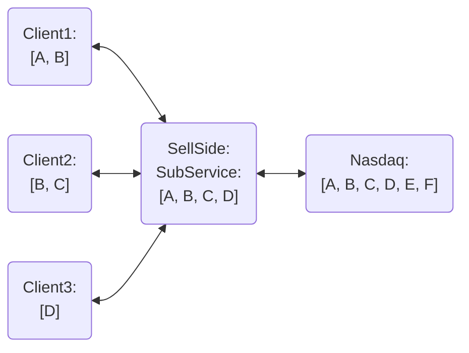

# stock-service

The below problem statement was given ...

- Nasdaq is the upstream data source where the sell side subscription service should subscribe to.
- Client should 'connect' to subscription service with the target list of stocks symbols.
- 'Disconnect' scenario: e.g. when Client3 disconnect from subscription service, subscription service should unsubscribe from Nasdaq too.
- This is because after checking all the connected clients, sub service understands no one is still interested in stock D.

Focus on ...

- Service contracts (POJO)
- Services
- Test Coverage
- Concurrency
